# Controle de acesso multinível por reconhecimento facial


Aplicação desktop em Python que protege um cadastro **fictício** de materiais perigosos ainda não recolhidos —
resíduo químico Classe I, rejeito radioativo, áreas contaminadas. O acesso combina **senha e reconhecimento
facial ao vivo**, com exigência crescente em três níveis, e o conteúdo é entregue com **tarja adaptativa** e
**marca d'água invisível**. Toda tentativa, consulta e exportação entra numa **trilha de auditoria encadeada por
hash**.

> A ideia central não é "reconhecer rostos". É que **o grau de confiança que a visão computacional entrega
> determina quanta informação o pixel pode revelar.**

<p align="center">
  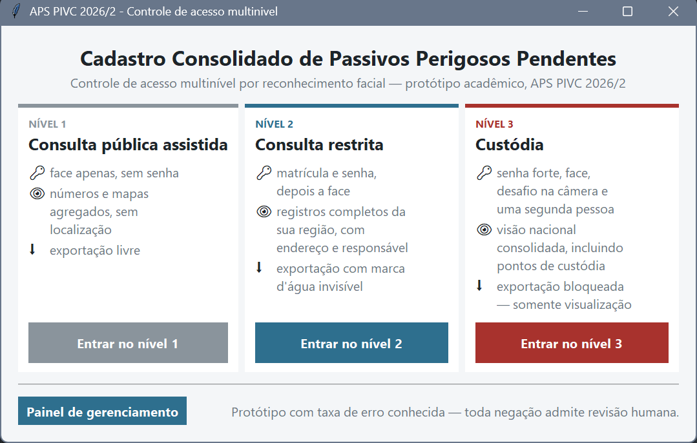
</p>

---

## Os três níveis

| Nível | Quem | Fatores exigidos | Modo facial | O que vê | Exporta |
|---|---|---|---|---|---|
| **1** | Servidores | face | **1:N** | agregados, sem localização | livre |
| **2** | Diretores | matrícula + senha → face | **1:1** | registros da própria UF | com marca d'água |
| **3** | Ministro | + senha forte + desafio na câmera + **segunda pessoa** | **1:1** (limiar mais duro) | visão nacional | **bloqueado** |

O mesmo item do acervo é servido de formas diferentes conforme o nível: no `A1-05 Mapa de Densidade`, as
coordenadas aparecem borradas no nível 1, legíveis no 2, e a instalação de custódia só no 3 — e a supressão é
aplicada **antes** de a imagem chegar à interface, não como um retângulo desenhado por cima.

<p align="center">
  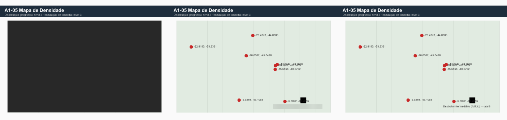
</p>

Acima, o mesmo arquivo nos níveis 1, 2 e 3. No nível 1 a área de plotagem inteira é suprimida — não só os
rótulos de coordenada. O motivo está medido abaixo.

<p align="center">
  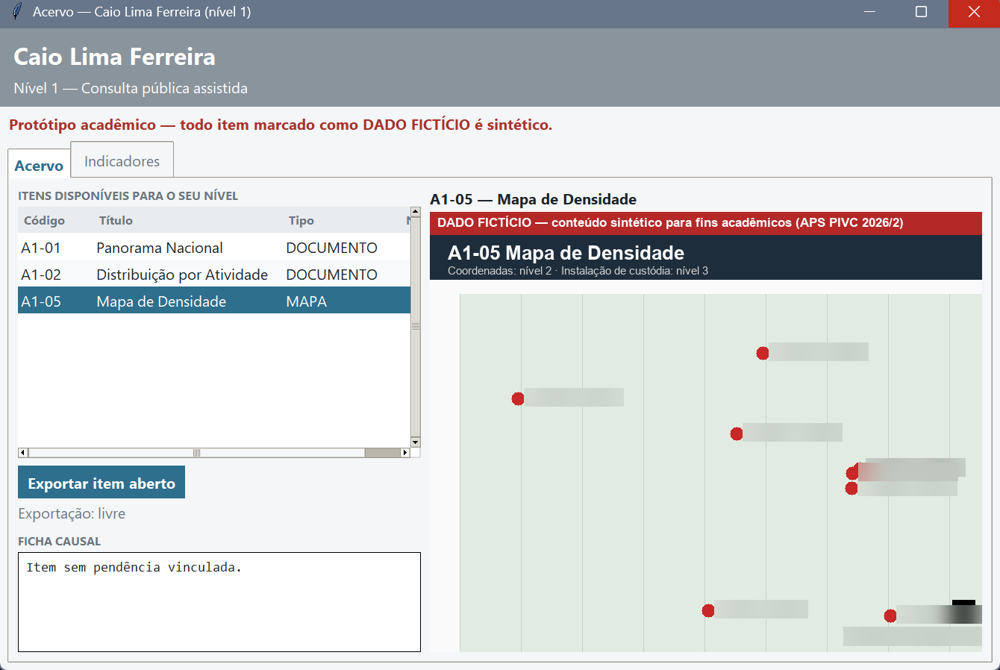
</p>

Acima, o nível 1 abrindo esse mapa: os pixels das coordenadas e da instalação de custódia chegam já borrados à
tela, e a ficha causal informa que a cadeia de responsabilidade só existe a partir do nível 2 (RF-21).

A tela de autenticação mostra os fatores que o nível exige e em qual deles a tentativa está. A lista sai de
`FATORES_POR_NIVEL` — a mesma estrutura que a política consulta para decidir — então a interface nunca anuncia
um fator que a decisão não exige:

<p align="center">
  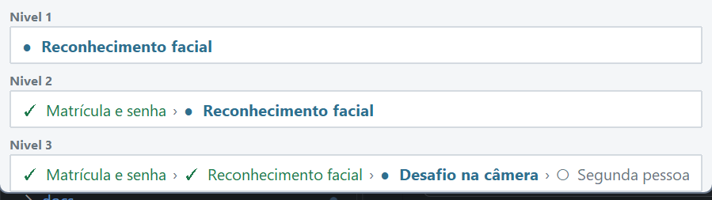
</p>

Durante o reconhecimento, a tela mostra quantos quadros coerentes já entraram, quanto tempo resta e — o mais
útil para explicar o método — a **distância medida ao lado do limiar do nível**. Vê-la cair enquanto o rosto se
estabiliza deixa evidente que o LBPH devolve distância, não similaridade: quanto menor, mais parecido.

<p align="center">
  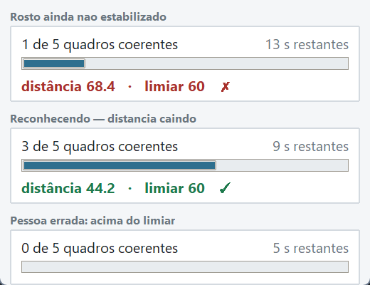
</p>

---

## As cinco fases do processamento de imagens

```
Aquisição  →  Pré-processamento  →  Segmentação  →  Extração  →  Classificação
 (thread +     (cinza, CLAHE,       (Haar + KCF)    (LBPH)       (distância ao
  fila 1)       ruído, 200×200)                                   modelo + limiar)
                          ↓
                 portão de qualidade  (nitidez, brilho, contraste, ruído)
```

- **Aquisição** roda em thread com fila de tamanho 1: o frame antigo é descartado quando chega um novo, então a
  latência nunca se acumula mesmo se o reconhecimento for mais lento que a câmera.
- **Qualidade é medida no recorte cru**, antes do CLAHE — o realce mascara justamente a imagem escura e sem
  contraste que o portão existe para barrar.
- **LBPH devolve distância, não similaridade**: aceita-se quando `distancia <= limiar`. Inverter esse sinal
  inverteria a política de segurança inteira, e há teste dedicado a isso.
- **Haar roda a cada N frames**; entre duas detecções o **KCF** acompanha a ROI, que custa uma fração do custo.

---

## Painel de gerenciamento

<p align="center">
  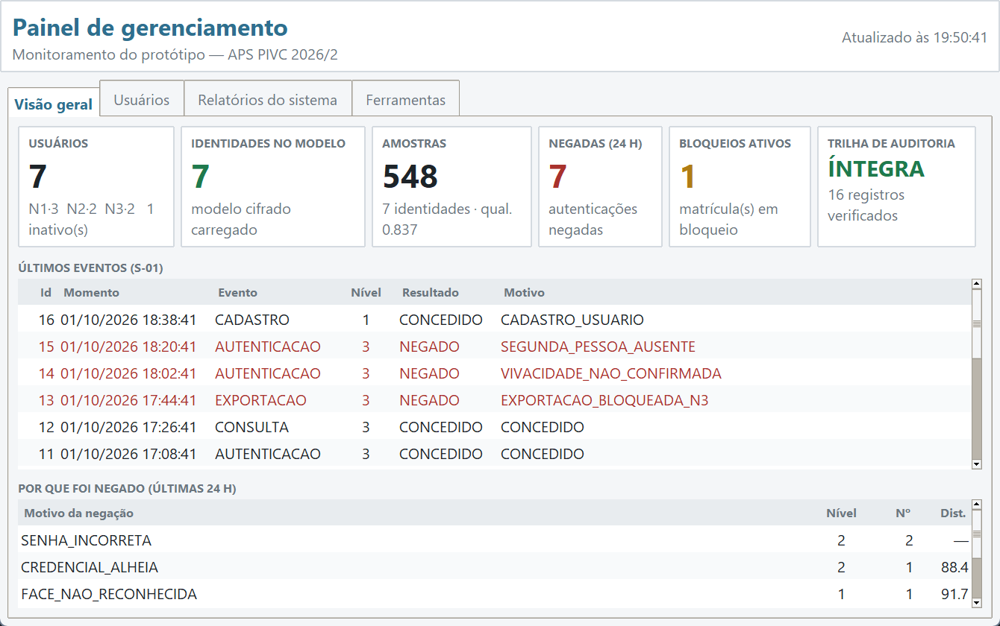
</p>

Acompanha o estado do sistema sem abrir o banco na mão: usuários por nível, amostras, negativas nas últimas 24 h,
bloqueios ativos, integridade da cadeia de hash e — o indicador mais útil — a **divergência entre o modelo LBPH
em memória e as amostras registradas no banco**, que denuncia modelo perdido, recriado com outra chave ou
cadastro interrompido.

<p align="center">
  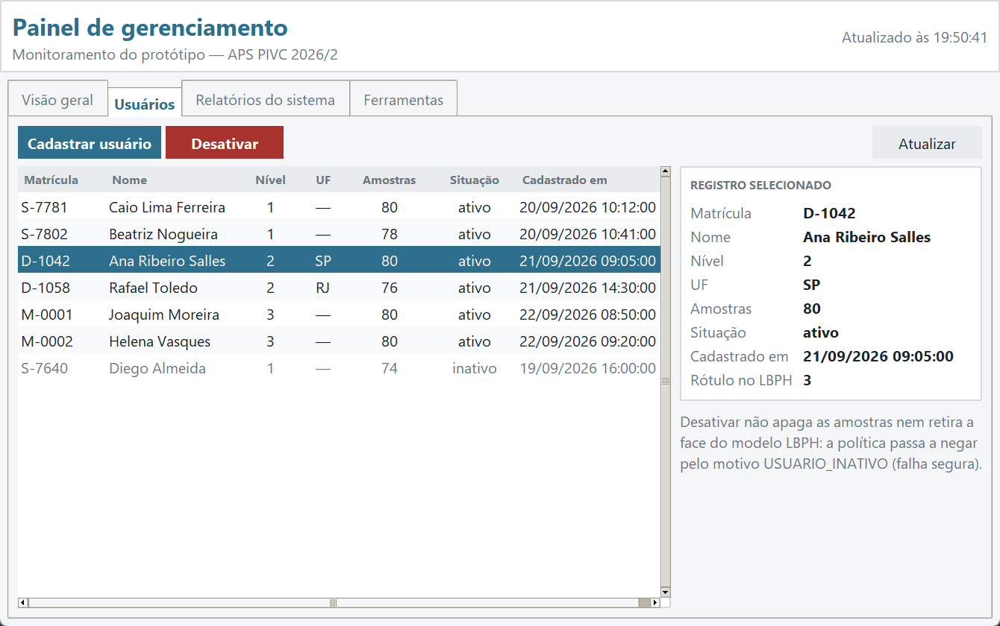
</p>

<p align="center">
  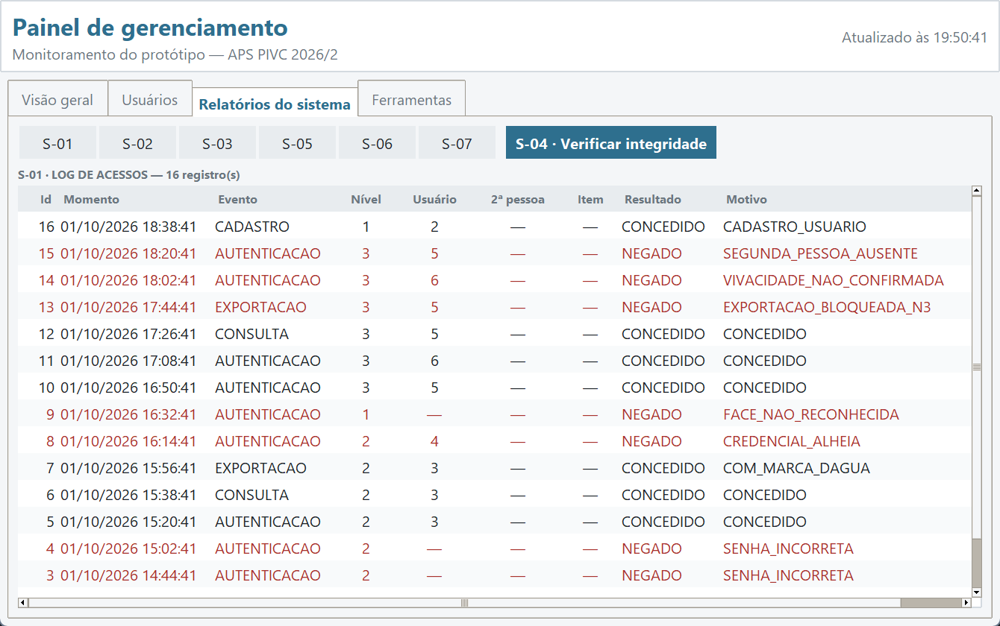
</p>

Os relatórios do sistema (S-01 a S-07) ficam em tabelas ordenáveis, com as negativas destacadas. O S-04 é o
único que não é tabela: ele percorre a cadeia de hash inteira e devolve um veredito — íntegra, ou o `id` exato
onde a sequência foi rompida.

Desativar um usuário **não** apaga amostras nem retira a face do modelo: a política passa a negar pelo motivo
`USUARIO_INATIVO`, e o ato entra na mesma cadeia de hash dos acessos — é decisão auditável, não configuração
silenciosa.

O próprio **acesso ao painel** é tratado como qualquer outra autenticação: a senha errada conta para o mesmo
contador de bloqueio do login comum e o evento entra na trilha. Era a única porta do sistema que podia ser
tentada indefinidamente sem travar e sem deixar rastro — a assimetria estava no lado errado, porque aqui o
estrago de um acerto é maior, não menor. Cancelar o diálogo não conta como tentativa: desistir não é errar.

---

## Cadastro

<p align="center">
  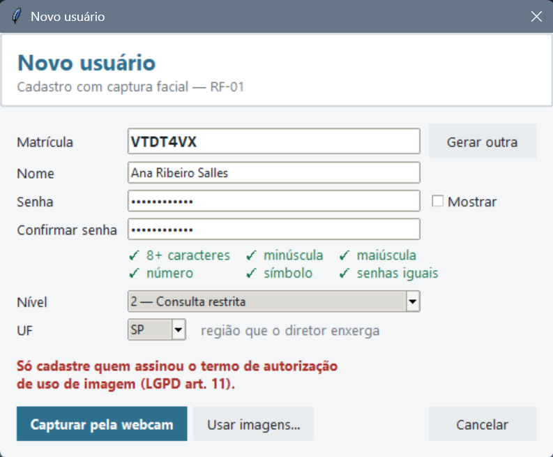
  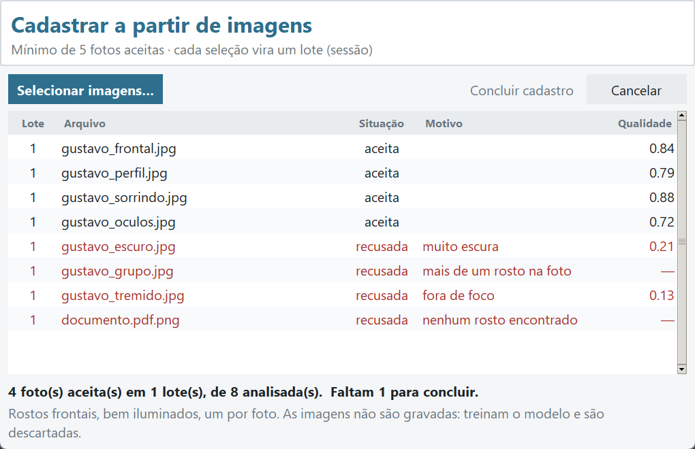
</p>

Durante a captura, o vídeo mostra uma **moldura de enquadramento** e o sistema avisa sobre distância e
centralização — o que o portão de qualidade não mede, e é justamente o que a pessoa consegue corrigir na hora.
As recusas dizem a ação, não o diagnóstico: *"acenda uma luz à sua frente"* em vez de *"imagem escura"*.

A sessão **não tem prazo**, de propósito: ninguém deve ser barrado por demorar. O preço disso é que alguém com a
luz atrás de si ficaria olhando o contador parado em *"12 de 40"* sem saber o que mudar. Por isso, passados
alguns segundos sem nenhuma amostra aceita, a instrução deixa de apenas descrever e passa a sugerir o ajuste
correspondente ao motivo que mais barrou amostras.

Nas telas de autenticação vale a regra oposta. Uma falha de identidade responde **sempre o mesmo**, venha ela de
rosto desconhecido ou de rosto que não casa com a matrícula: dizer *"não confere com a matrícula"* confirmaria a
quem tenta entrar que a **senha** estava correta. A distinção existe, mas só no motivo gravado na trilha, onde
serve à auditoria e não ao atacante.

A matrícula é **gerada pelo sistema**, nunca escolhida: o alfabeto exclui `I`, `O`, `0` e `1` — os caracteres que
mais se confundem ao ler de um crachá — porque ela é digitada no login dos níveis 2 e 3.

As faces podem vir da **webcam** (duas sessões, com iluminações distintas) ou de **arquivos de imagem**. As fotos
passam pelo mesmo Haar e pelo mesmo portão de qualidade da captura ao vivo; a tela devolve um laudo por foto
dizendo *por que* cada uma foi recusada (*muito escura*, *fora de foco*, *mais de um rosto na foto*).

---

## Instalação

**Requisitos:** Python 3.11, MySQL 8 (ou Docker) e uma webcam.

```bash
# 1. ambiente — o uv baixa o 3.11 sem mexer no Python do sistema
uv venv --python 3.11 .venv
uv pip install --python .venv/Scripts/python.exe -r requirements.txt

# 2. banco
docker compose up -d        # sobe o MySQL na porta 3307 e cria o schema

# 3. credenciais
cp .env.exemplo .env
python -m ferramentas gerar-chave     # cole em CHAVE_CIFRAGEM
python -m ferramentas hash-admin      # cole em ADMIN_SENHA_HASH

# 4. acervo de exemplo
python -m ferramentas importar-acervo

# 5. conferir o ambiente (webcam, FPS, LBPH, KCF)
python verificar_ambiente.py
```

> ⚠️ **A armadilha nº 1 do projeto:** é preciso `opencv-contrib-python`. O `opencv-python` comum **não tem
> `cv2.face`** (LBPH), e os dois no mesmo ambiente conflitam em silêncio. O `requirements.txt` já está correto —
> não instale outro OpenCV por cima.

> ⚠️ **No Windows, `python` pode não ser o do ambiente.** Se o venv não estiver ativado, `python` resolve para o
> Python do sistema e o erro aparece num lugar que não faz sentido nenhum — já vimos
> `ModuleNotFoundError: No module named 'tempfile'`, que é a biblioteca padrão faltando, não uma dependência do
> projeto. Na dúvida, chame o interpretador pelo caminho: `.venv\Scripts\python.exe -m pytest`. Para ativar,
> `.venv\Scripts\Activate.ps1`; se o PowerShell recusar, `Set-ExecutionPolicy -Scope CurrentUser RemoteSigned`.

Sem Docker, execute `sql/01_schema.sql`, `sql/02_dados_iniciais.sql` e `sql/03_usuarios.sql` como root, nessa ordem.

---

## Como usar

| Comando | O que faz |
|---|---|
| `python main.py` | Aplicação completa. Comece pelo **Painel de gerenciamento** e cadastre os usuários |
| `python esqueleto.py Gustavo Ana` | **Prova das 5 fases sem banco**: captura, treina em memória e reconhece ao vivo mostrando nome, distância, ms e FPS |
| `python -m pytest` | Os 246 testes (não precisa de câmera; o de integração sobe um banco descartável) |
| `python -m ferramentas verificar-trilha` | Verifica a cadeia de hash e aponta onde ela foi rompida |
| `python -m ferramentas extrair-marca ARQ.png` | Recupera quem exportou um arquivo, e quando |
| `python -m ferramentas inspecionar REF ATUAL` | Compara duas fotos de acondicionamento (ORB + SSIM) |
| `python -m ferramentas expurgar-fotos` | Apaga as fotos de tentativas negadas que passaram do prazo (retenção mínima, LGPD art. 15) |
| `python -m ferramentas limpar-operacao` | Zera usuários, amostras, bloqueios e trilha; **preserva o acervo**. Sem `--confirmar`, só mostra o que seria removido |
| `python -m experimentos.executar` | Gera curva DET, matriz de confusão e os limiares sugeridos |
| `python -m experimentos.marca` | Robustez da marca d'água sob JPEG, redimensionamento, recorte e captura de tela |
| `python -m experimentos.inspecao_pares` | 20 pares de inspeção, metade alterados — sensibilidade e falso positivo |

O `esqueleto.py` é o caminho mais rápido para ver o projeto funcionando: não precisa de banco nenhum.

### Roteiro de demonstração

1. **Painel** → cadastrar um N1, um N2 com UF `SP` e **dois** N3 (a regra dos dois exige duas identidades).
   O **termo de consentimento** aparece antes da câmera, e o aceite só libera depois de o texto poder ser lido
   por inteiro — mostre que "Não concordo" encerra sem coletar nada.
2. **Nível 1** → só a face → abrir `A1-05`: coordenadas e custódia borradas.
3. **Nível 2** → mesmo mapa com as coordenadas visíveis → exportar → `extrair-marca` recupera quem exportou.
4. **Nível 3** → senha forte + face + desafio + segunda pessoa → mapa completo, exportação bloqueada, sessão com
   tempo-limite.
5. **Negações:** senha errada 3× (bloqueio), face de outra pessoa com a senha certa (credencial alheia), N1
   tentando o N2.
6. **Adulteração:** alterar um registro de `log_acesso` como root → `verificar-trilha` aponta o `id` exato.
7. **Direitos do titular:** no painel, revogar o consentimento de alguém → o cadastro é desativado junto, porque
   sem consentimento não resta base legal (art. 8º, §5º), e a baixa é marcada, nunca apagada.

---

## Resultados já medidos

Dois experimentos da ETP 7.2 rodam sem câmera e sem voluntários, direto sobre o acervo sintético.

**Robustez da marca d'água** (20 repetições por célula):

<p align="center">
  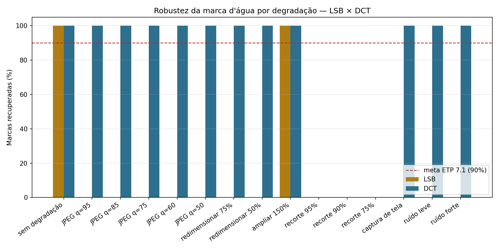
</p>

O DCT recupera **100%** sob recompressão JPEG até q=50, acima da meta de 90% da ETP 7.1, e sobrevive à captura
de tela — o contorno óbvio do bloqueio de exportação do nível 3. O LSB cai a zero em qualquer recompressão, que
é exatamente o papel dele no trabalho: o contraponto que justifica o DCT.

Dois resultados contrariaram a previsão e ficaram registrados por isso: o **DCT resistiu ao redimensionamento**
(porque a degradação devolve a imagem ao tamanho original, realinhando a grade 8×8), e o **LSB sobreviveu à
ampliação de 150%** — 97,9% dos bits chegam intactos e a votação majoritária sobre a carga repetida cobre o
resto. Já reduzir a 50% preserva 69,6% dos bits e ainda assim falha: os erros são espacialmente correlacionados,
então algumas das 80 posições ficam com maioria errada. **O recorte derruba os dois para zero**, e é o limite
declarado do método.

**Inspeção de acondicionamento** (20 pares, metade com alteração controlada):

<p align="center">
  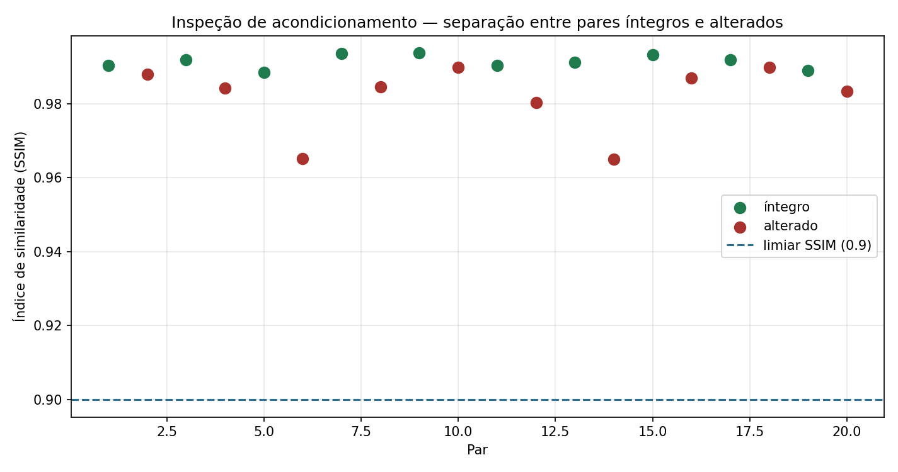
</p>

Sensibilidade **100%**, falso positivo **0%**, alinhamento ORB bem-sucedido em todos os pares — o tremor de
câmera é absorvido, como deve ser.

O gráfico, porém, mostra algo que a acurácia esconderia: **o SSIM dos pares alterados (0,98) está acima do
limiar configurado (0,90)**. Nenhuma detecção veio dele. O SSIM é uma média sobre a imagem inteira, e um lacre
rompido quase não a move — quem acusa é a análise de regiões. O limiar de SSIM, como está, só pegaria uma
degradação do quadro todo. Isso está fixado em teste para não se perder.

---

## Arquitetura

```
visao/         aquisicao · preprocessamento · segmentacao · qualidade · extracao · pipeline · coleta
autenticacao/  politica (decisão pura) · senha (bcrypt) · vivacidade (desafio) · motor (orquestração)
dados/         conexao · repositorio · auditoria (cadeia SHA-256) · relatorios_sistema · manutencao
acervo/        tarja · marca_dagua (LSB/DCT) · inspecao (ORB/SSIM) · entrega · repositorio_acervo
lgpd/          termo (texto versionado + hash do que foi apresentado)
interface/     tema (paleta, Cartao, Tabela) · comum (Contexto, Visor, portão admin) · painel
               autenticacao · relatorios · cadastro · termo (consentimento prévio)
experimentos/  protocolo (divisão por sessão) · metricas (FAR/FRR/EER/DET) · executar · capturar
testes/        conftest (uma raiz Tk por sessão) · 19 módulos · 246 testes
sql/           schema com camada causal · dados de referência · contas separadas
```

Três escolhas que sustentam o resto:

**A decisão de acesso é uma função pura.** `autenticacao/politica.py` recebe as evidências já coletadas e devolve
concedido/negado. Não toca em câmera nem em banco — por isso tem 22 testes isolados. A regra que a governa é a
falha segura: evidência ausente (`None`) conta como fator **não** cumprido, e não existe caminho em que a falta
de informação conceda acesso.

**A aplicação não consegue reescrever o passado.** A conta `aps_app` tem apenas `SELECT` e `INSERT` em
`log_acesso` — sem `UPDATE` nem `DELETE`. O encadeamento usa `GET_LOCK` em vez de `SELECT … FOR UPDATE`
justamente para não precisar desse privilégio. Adulterar a trilha exige a conta administrativa, e mesmo assim a
cadeia de hash denuncia e **localiza** a alteração.

**A supressão acontece antes da entrega.** `acervo/tarja.py` aplica filtro gaussiano de núcleo grande sobre uma
cópia; a interface nunca recebe o pixel original de uma região que o nível não autoriza.

---

## Decisões de projeto

Pontos em que a implementação divergiu do plano inicial, e por quê:

1. **`log_acesso.momento` é gravado pela aplicação**, em `DATETIME(6)`. Com `DEFAULT CURRENT_TIMESTAMP`, o momento
   que entra no hash poderia diferir do gravado e a verificação falharia.
2. **`distancia` e `qualidade` em `DECIMAL`.** `FLOAT` perde precisão na volta do banco e quebra a recomputação do hash.
3. **A verificação 1:1 usa o `StandardCollector`** do OpenCV, filtrando pela identidade informada. É verificação de
   fato, não um `predict()` com o rótulo comparado depois.
4. **A divisão treino/teste é por sessão de captura, não por frame.** Frames da mesma sessão são quase idênticos;
   espalhá-los entre treino e teste infla a acurácia. Implementada à mão, equivalente ao `GroupShuffleSplit`.
5. **A marca DCT comprime a luminância em ±12 níveis antes da inserção.** Sem isso o fundo branco dos documentos
   satura em 255 e apaga a marca.
6. **As telas se dimensionam pela métrica da fonte, não em pixels.** Medida fixa trunca texto em monitor com
   escala de DPI — 100% na máquina de quem desenvolve, 150% na de quem apresenta. A mesma causa tirou da tela o
   botão de avançar entre as sessões de captura: a janela crescia além do monitor e o que saía era sempre a
   parte de baixo. Desde então **todo controle é ancorado na base antes do vídeo entrar**, e o vídeo fica com a
   sobra medida — nunca o contrário, porque ele é o único elemento que encolhe sem prejuízo. Há testes que
   recusam qualquer janela maior que a tela ou com botão fora do quadro.
7. **Os testes de integração têm banco próprio**, recriado a cada execução. Antes sujavam o banco de demonstração,
   e limpar depois era impossível sem quebrar a cadeia: `usuario_id` entra no hash e a FK prende o usuário.
8. **A exportação gera PNG, não PDF.** LSB e DCT marcam pixels; um PDF exigiria rasterizar.

### Borrar um gráfico não esconde onde as coisas estão

A primeira versão suprimia apenas os rótulos de coordenada do mapa, deixando os pontos à vista — o nível 1
enxergava a distribuição geográfica, contrariando o "agregados, sem localização" do RF-20. Corrigido isso,
restava um problema mais sutil: o filtro gaussiano **preserva o centroide**. Medindo o resíduo de cor da área
borrada, o pico caía a **0 px** de um ponto original.

Para texto o borrão basta, porque a informação está nos caracteres e eles ficam ilegíveis. Para posição não:
a informação está na forma, e o borrão a preserva. Rótulos listados em `[tarja] rotulos_supressao_total`
passaram a receber supressão sólida, e um teste exige que a região suprimida fique com variância zero — sem
nenhuma estrutura de onde inferir posição.

### Uma falha encontrada pelos testes

Quando o rosto encosta na borda do quadro, o KCF devolve retângulo com coordenada negativa, e a fatia da metade
superior sai **vazia**. O Haar de olhos responde "nenhum olho" para imagem vazia **sem levantar erro** — então os
frames eram contados como olhos fechados, e bastava aparecer e sair de cena para o sistema dar a piscada por
vista, cumprindo o desafio de vivacidade sem piscar.

A correção limita o recorte à imagem e exige que ao menos 60% dele esteja dentro do quadro; abaixo disso o frame é
*inconclusivo*, não "olhos fechados". É um caso concreto de detector que falha em silêncio — e de por que testar
função de segurança exige cobrir a entrada degenerada, não só o caminho feliz.

### O que a tela faz quando ninguém segue o roteiro

As duas falhas acima apareceram lendo o código e rodando testes. Uma terceira leva só apareceu **sondando a
interface** — fazendo o que a pessoa faz quando desiste no meio, fecha a janela errada ou clica duas vezes.
Vale registrar o padrão, porque ele se repetiu: **o caminho feliz estava sempre correto; o que faltava era o
caminho de saída.**

| O que a pessoa faz | O que acontecia |
|---|---|
| Fecha "Cadastrar a partir de imagens" pelo **X** | As faces carregadas ficavam na memória — só o botão "Cancelar" descartava |
| Fecha o **formulário de cadastro** durante a captura | A janela de captura morria junto, sem passar pelo descarte |
| O cadastro **falha no meio** (disco cheio, banco fora) | A biometria ficava retida, e o usuário já criado ficava **ativo sem rosto no modelo salvo** |
| Desiste no meio da **regra dos dois** (N3) | A tentativa da primeira pessoa nunca recebia desfecho na trilha |
| Clica duas vezes em **"Concordo e autorizo"** | Abriam-se **duas** janelas de captura para a mesma pessoa |

As três primeiras são o mesmo erro de desenho: o descarte estava pendurado no *botão*, não na *morte da janela*.
Passou a ficar no evento `<Destroy>`, que é o único ponto por onde todas as saídas passam — com uma ressalva
para a conclusão bem-sucedida, que precisa das faces vivas para treinar e as apaga logo em seguida.

A quarta é a mais interessante para a auditoria: **um acesso de nível 3 em aberto é indistinguível de um acesso
concedido**. Uma trilha que não registra o desfecho não serve como trilha.

Para garantir que esses testes não fossem decorativos, cada correção foi desfeita de propósito e a suíte tinha
de acusar: **14 mutações, 14 detectadas**. Duas delas revelaram testes que passavam com e sem o bug — foram
reescritos.

---

## Privacidade e LGPD

Imagem de rosto é dado pessoal **sensível** (Lei 13.709/2018, art. 5º, II), e tratá-la exige consentimento
**específico e destacado** (art. 11, I). O sistema pede esse consentimento **antes** de abrir a câmera:

<p align="center">
  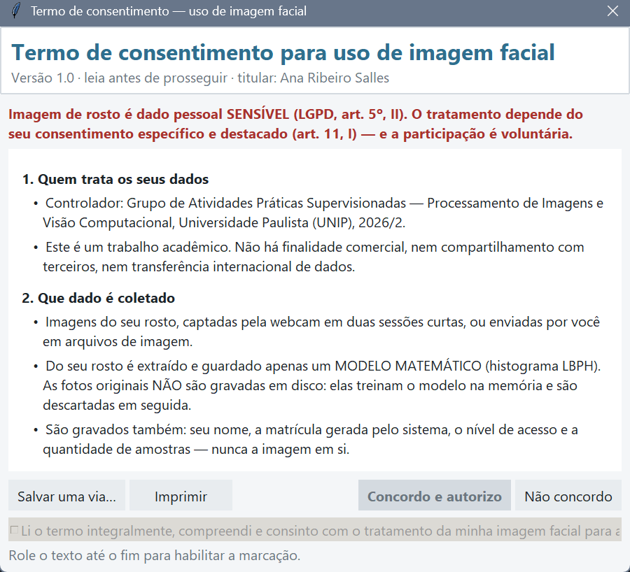
</p>

A ordem é exigência legal, não preferência — pedir depois de já ter capturado o rosto significaria ter tratado
dado sensível sem base legal. A pessoa pode **salvar ou imprimir** a via do titular, com espaço para assinatura,
e o aceite só é habilitado depois de o texto poder ser lido por inteiro.

O que o aceite grava não é um "sim": é o **hash SHA-256 do texto apresentado**. Provar o consentimento é ônus do
controlador (art. 8º, §2º), e registrar "aceitou a versão 1.0" não provaria nada se o texto da 1.0 mudasse
depois. A revogação (art. 8º, §5º) está implementada no painel e é **marcada, nunca apagada** — a baixa também
é evidência, e o cadastro é desativado junto, porque sem consentimento não resta base legal.

- Imagens faciais **nunca vão para disco** no fluxo da aplicação: ficam em memória, treinam o modelo e são
  descartadas. O modelo é salvo **cifrado** (Fernet) em `modelo/lbph.yml.enc`.
- O descarte cobre **toda** saída da tela de captura — concluir, cancelar, `Esc`, o X da janela, fechar a janela
  de trás e falhar no meio do cadastro — e cada uma dessas saídas tem teste próprio (ver abaixo).
- Fotos de tentativas negadas são guardadas **cifradas** e com prazo de expiração; `ferramentas expurgar-fotos`
  apaga as vencidas. Sem `CHAVE_CIFRAGEM` no `.env` a foto é simplesmente descartada — falha segura.
- Todo o conteúdo do acervo é **sintético** — empresas, municípios e coordenadas inventados — e aparece com a
  faixa permanente "DADO FICTÍCIO".
- O `.gitignore` bloqueia `.env`, `modelo/`, `dados_faciais/`, `*.yml` e dumps do banco.
- Captura de rostos só mediante **termo de autorização de uso de imagem** assinado (LGPD art. 11).

---

## Estado atual e limitações

**Funciona e está testado:** política de níveis, trilha encadeada com adulteração localizada, tarja, marca d'água
LSB/DCT, inspeção ORB+SSIM, métricas FAR/FRR/EER, painel, cadastro por webcam e por imagens, termo de
consentimento e descarte da biometria em todos os caminhos de saída.

**A senha do administrador é `123APS`** enquanto durar o desenvolvimento. Não cumpre a política que o próprio
sistema exige do nível 3, e **precisa ser regerada antes da entrega** com `python -m ferramentas hash-admin`.

**Ainda não validado com câmera real:** o reconhecimento ao vivo, o desafio de vivacidade e a regra dos dois ponta
a ponta. O código existe e tem testes, mas com imagens sintéticas.

**Os limiares são provisórios.** Enquanto a curva DET não for levantada com a base real, qualquer número de
FAR/FRR citado é inválido — os valores em `[limiares]` são palpites conservadores.

**A vivacidade não é anti-spoofing robusto.** O desafio barra fotografia estática, mas um vídeo da pessoa fazendo
o gesto pedido passaria. A piscada via Haar de olhos é instável com óculos.

---

## Contexto

Trabalho da disciplina de **Processamento de Imagens e Visão Computacional** — UNIP, 2026/2.

Todos os parâmetros ficam em [`config.ini`](config.ini); nenhum valor fixo no código. As pendências e os próximos
passos estão em [`TAREFAS.md`](TAREFAS.md).
